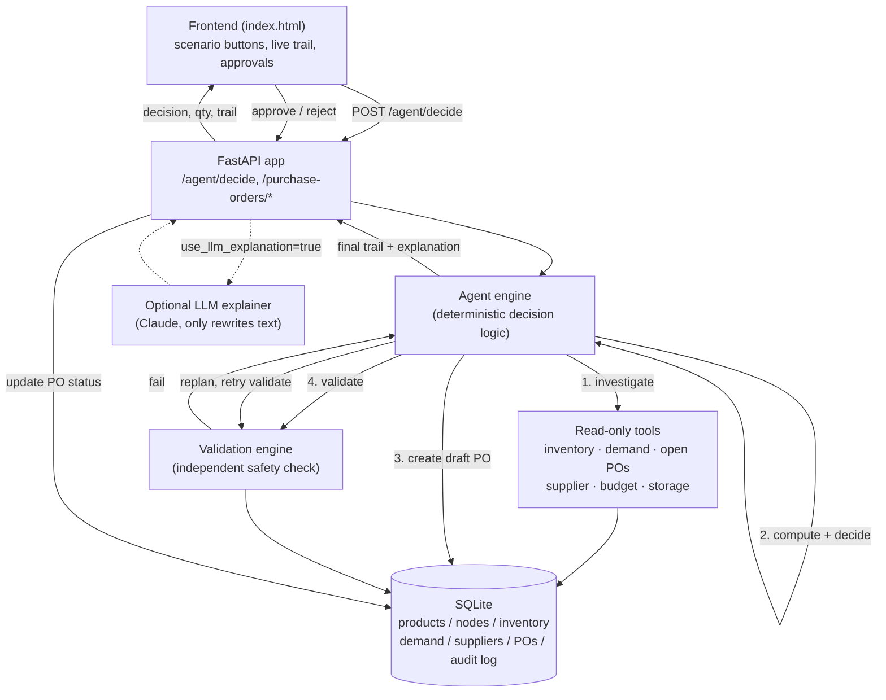
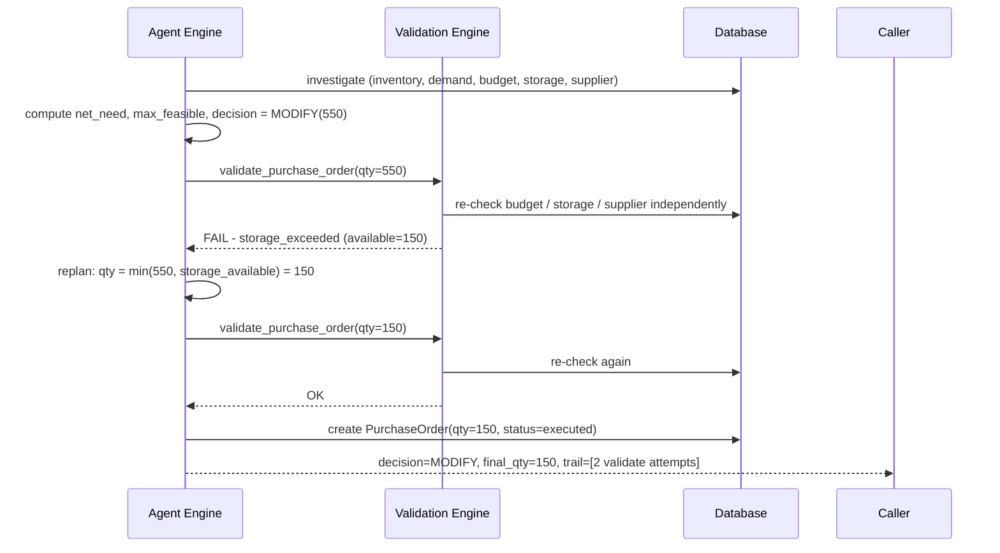
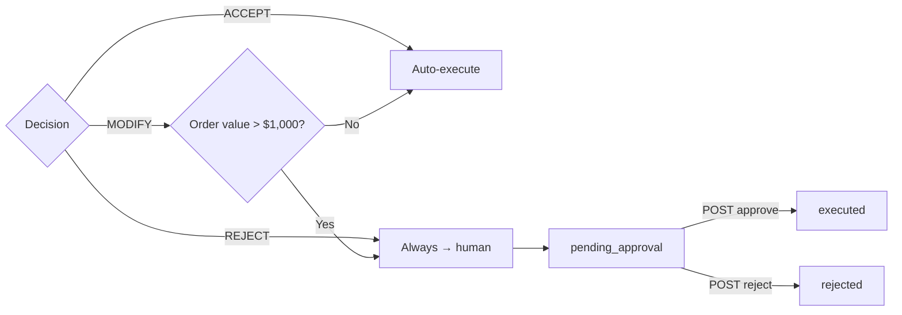

# Architecture

## System overview

## The feedback loop (the core of the assignment)

Two properties make this a real feedback loop rather than theater:

1. **The validator is independent of the decision logic.** It re-derives
   every hard limit from the database itself; it does not trust or inspect
   *how* the engine picked a number. It would reject a hand-crafted bad PO
   just as readily (see `test_validation_independently_catches_a_bad_po`).
2. **The replan step reads the validator's specific violation**, not just
   "it failed" — a `storage_exceeded` violation shrinks toward available
   storage, `budget_exceeded` shrinks toward what the budget allows, etc.
   If it still can't find a valid quantity above the supplier's minimum
   after a few attempts, it stops trying and escalates to a human instead
   of looping forever or returning a wrong number.

## Where human approval sits

This keeps low-risk, self-corrected purchases moving without a person in
the loop, while anything expensive or fundamentally blocked still gets a
human's sign-off — matching the assignment's ask for "when human approval
may be appropriate."

## Why deterministic core + optional LLM

The assignment states the purchasing recommendation should not be assumed
correct, and that an LLM should not own arithmetic or hard constraints. So
the engine (`app/agent/engine.py`) is plain, typed Python: every quantity,
every constraint check, and the decision type are computed the same way
every time, with or without an API key. `app/agent/llm.py` is a thin,
optional layer that can rewrite the explanation text for a human buyer using
Claude — it is given the trail as read-only context and is explicitly
instructed not to change the numbers or the decision. Any failure in that
layer (no key, network error, bad output) silently falls back to the
deterministic explanation, so the agent's actual behavior never depends on
an LLM being available.
